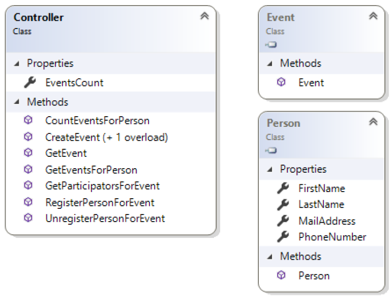

# EventCalendar mit .NET-Collections

## Lehrziele

* Wiederholung Objektorientierung
    * Abgeleitete Klassen
    * Überschriebene Methoden
*	Schnittstellen:
    * `IComparable<T>`
*	Collections: 
    * `List<T>`

Es ist ein Eventkalender zu implementieren welcher Veranstaltungen verwaltet. Eine Veranstaltung (`Event`) kann mehrere Personen als Teilnehmer (`Participator`) und eine Person als Einlader (`Invitor`) aufweisen. Es gibt spezielle Veranstaltungen, deren maximale Teilnehmerzahl begrenzt ist. Der Titel der Veranstaltung ist eindeutig.
Über einen Controller werden die Funktionalität zur Verfügung gestellt und mittels Unittests abgeprüft.

## Klassendiagramm

 

Ihre Implementierung erweitert die Anwendung um die erforderlichen Klassen und Methoden.

Die erwartete Funktionalität der Controllermethoden entnehmen Sie den Kommentaren und den Unittests!

## Hinweise
Die den `Invitor` betreffenden Funktionen werden noch nicht getestet.